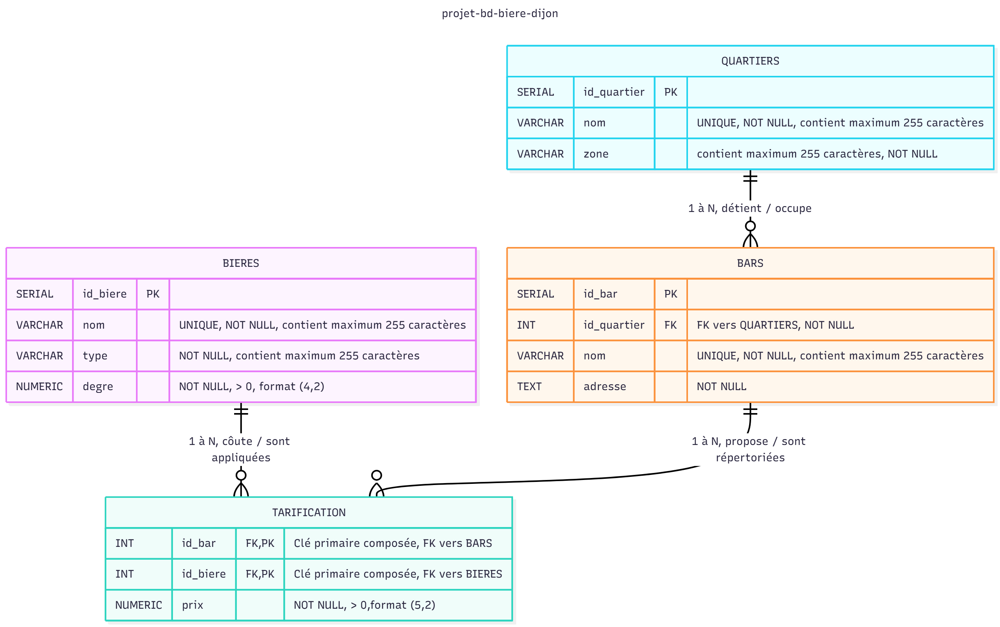

# MCD

## Code Mermaid

---
config:
  layout: elk
title: projet-bd-biere-dijon
---
erDiagram
	direction TB
  
	BARS {
		SERIAL id_bar PK ""  
		INT id_quartier FK "FK vers QUARTIERS, NOT NULL"  
		VARCHAR nom  "UNIQUE, NOT NULL, contient maximum 255 caractères"  
		TEXT adresse  ""  
	}

	BIERES {
		SERIAL id_biere PK ""  
		VARCHAR nom  "UNIQUE, NOT NULL, contient maximum 255 caractères"  
		VARCHAR type  "NOT NULL, contient maximum 255 caractères"  
		NUMERIC degre  "NOT NULL, > 0, format (4,2)"  
	}

	TARIFICATION {
		INT id_bar FK,PK "Clé primaire composée, FK vers BARS"  
		INT id_biere FK,PK "Clé primaire composée, FK vers BIERES"  
		NUMERIC prix  "NOT NULL, > 0,format (5,2)"  
	}

	QUARTIERS {
		SERIAL id_quartier PK ""  
		VARCHAR nom  "UNIQUE, NOT NULL, contient maximum 255 caractères"  
		VARCHAR zone  "contient maximum 255 cractères"  
	}

	QUARTIERS||--o{BARS:"1 à N, détient / occupe"
	BARS||--o{TARIFICATION:"1 à N, propose / sont répertoriées"
	BIERES||--o{TARIFICATION:"1 à N, côute / sont appliquées"

  ## Diagramme Mermaid

  

  ## Tableaux des relations, cardinalités, entités et attributs

  | Relation | Cardinalité | Verbe | Lecture |
|:----------|:-------------:|:------------------:|:----------|
| Quartiers -> Bars | 1..N | détient | Un quartier détient plusieurs bars. |
| Bars -> Quartiers | N..1 | occupe | Chaque bars occupe un seul quartier. |
| Bars -> Tarification | 1..N | propose | Un bar propose plusieurs tarifications. |
| Tarfication -> Bars | N..1 | sont répertoriées | Diverses tarifications sont répertoriées pour un même bar. |
| Bieres -> Tarification | 1..N | coûte | Une bière coùte différentes tarifications. |
| Tarification -> Bieres | N..1 | sont appliquées | Diverses tarifications sont appliquées pour une même bière. |
| Bars -> Bieres (implicite via tarification) | N..N | propose | Un bar propose plusieurs bières différentes. |
| Bieres -> Bars (implicite via tarification) | N..N | sont répertoriées | Diverses bières sont répertoriées dans un même bar. |

| Entités | Attributs | Description |
|:---|:---|:---|
| **Quartiers** | id_quartier | Identifiant unique du quartier(clé primaire). |
|  | nom | Nom du quartier. |
|  | zone | Zone géographique dans laquelle réside le quartier(ex: Nord de Dijon). |
| **Bars** | id_bar | Identifiant unique du bar(clé primaire). |
|  | id_quartier | Identifiant unique du quartier(clé étrangère). |
|  | nom | Nom du bar. |
|  | adresse | Adresse complète du bar. |
| **Bieres** | id_biere | Identifiant unique de la bière(clé primaire). |
|  | nom | Nom officiel de la bière. |
|  | type | Type de la bière(ex:blonde ou brune). |
|  | degre | Degré d'alcool de la bière. |
| **Tarification** | id_bar + id_biere (clé primaire composée) | Identifiant unique de la tarification qui est constitué par l'assocation des FK de Bars et Bieres. |
|  | id_bar | Identifiant unique du bar (clé étrangère). |
|  | id_biere | Identifiant unique de la bière(clé étrangère). |
|  | prix | Valeur d'une tarification. |
